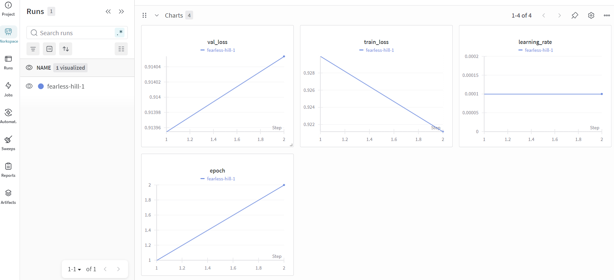
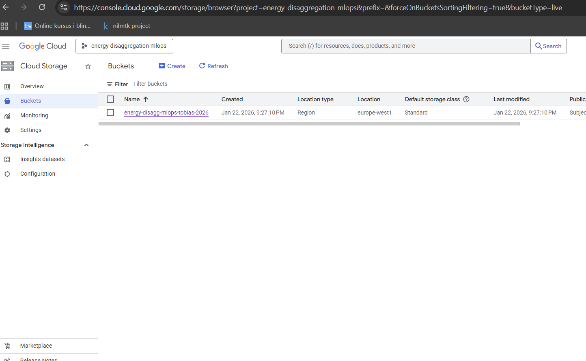
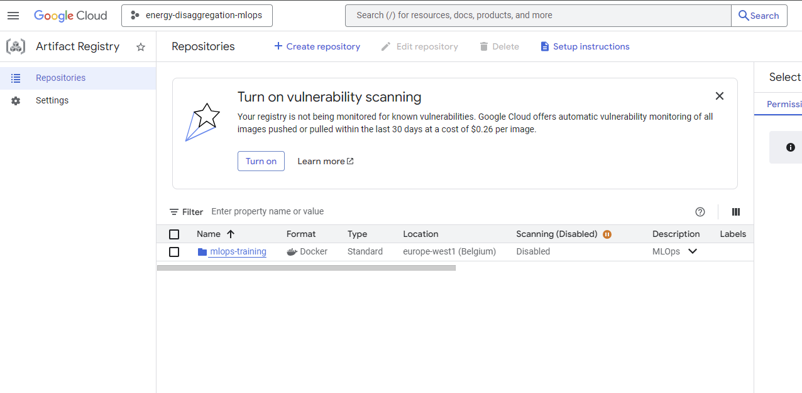
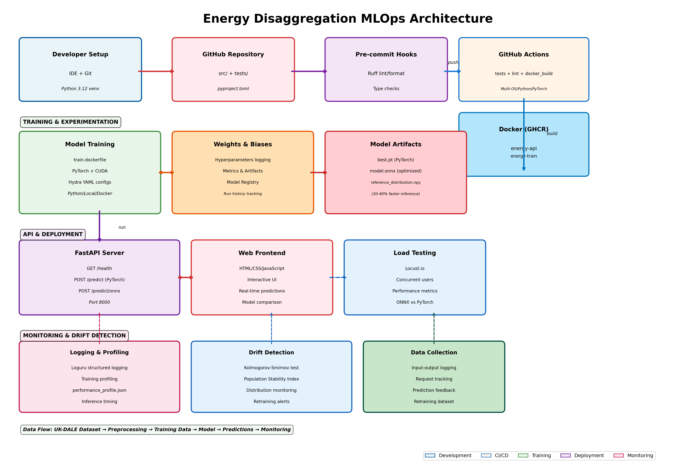

# Exam template for 02476 Machine Learning Operations

This is the report template for the exam. Please only remove the text formatted as with three dashes in front and behind
like:

```--- question 1 fill here ---```

Where you instead should add your answers. Any other changes may have unwanted consequences when your report is
auto-generated at the end of the course. For questions where you are asked to include images, start by adding the image
to the `figures` subfolder (please only use `.png`, `.jpg` or `.jpeg`) and then add the following code in your answer:

``

In addition to this markdown file, we also provide the `report.py` script that provides two utility functions:

Running:

```bash
python report.py html
```

Will generate a `.html` page of your report. After the deadline for answering this template, we will auto-scrape
everything in this `reports` folder and then use this utility to generate a `.html` page that will be your serve
as your final hand-in.

Running

```bash
python report.py check
```

Will check your answers in this template against the constraints listed for each question e.g. is your answer too
short, too long, or have you included an image when asked. For both functions to work you mustn't rename anything.
The script has two dependencies that can be installed with

```bash
pip install typer markdown
```

or

```bash
uv add typer markdown
```

## Overall project checklist

The checklist is *exhaustive* which means that it includes everything that you could do on the project included in the
curriculum in this course. Therefore, we do not expect at all that you have checked all boxes at the end of the project.
The parenthesis at the end indicates what module the bullet point is related to. Please be honest in your answers, we
will check the repositories and the code to verify your answers.

### Week 1

* [X] Create a git repository (M5)
* [X] Make sure that all team members have write access to the GitHub repository (M5)
* [X] Create a dedicated environment for you project to keep track of your packages (M2)
* [X] Create the initial file structure using cookiecutter with an appropriate template (M6)
* [X] Fill out the `data.py` file such that it downloads whatever data you need and preprocesses it (if necessary) (M6)
* [X] Add a model to `model.py` and a training procedure to `train.py` and get that running (M6)
* [X] Remember to either fill out the `requirements.txt`/`requirements_dev.txt` files or keeping your
    `pyproject.toml`/`uv.lock` up-to-date with whatever dependencies that you are using (M2+M6)
* [X] Remember to comply with good coding practices (`pep8`) while doing the project (M7)
* [X] Do a bit of code typing and remember to document essential parts of your code (M7)
* [X] Setup version control for your data or part of your data (M8)
* [X] Add command line interfaces and project commands to your code where it makes sense (M9)
* [X] Construct one or multiple docker files for your code (M10)
* [X] Build the docker files locally and make sure they work as intended (M10)
* [X] Write one or multiple configurations files for your experiments (M11)
* [X] Used Hydra to load the configurations and manage your hyperparameters (M11)
* [X] Use profiling to optimize your code (M12)
* [X] Use logging to log important events in your code (M14)
* [X] Use Weights & Biases to log training progress and other important metrics/artifacts in your code (M14)
* [X] Consider running a hyperparameter optimization sweep (M14)
* [X] Use PyTorch-lightning (if applicable) to reduce the amount of boilerplate in your code (M15)

### Week 2

* [X] Write unit tests related to the data part of your code (M16)
* [X] Write unit tests related to model construction and or model training (M16)
* [X] Calculate the code coverage (M16)
* [X] Get some continuous integration running on the GitHub repository (M17)
* [X] Add caching and multi-os/python/pytorch testing to your continuous integration (M17)
* [X] Add a linting step to your continuous integration (M17)
* [X] Add pre-commit hooks to your version control setup (M18)
* [X] Add a continues workflow that triggers when data changes (M19)
* [X] Add a continues workflow that triggers when changes to the model registry is made (M19)
* [X] Create a data storage in GCP Bucket for your data and link this with your data version control setup (M21)
* [X] Create a trigger workflow for automatically building your docker images (M21)
* [X] Get your model training in GCP using either the Engine or Vertex AI (M21)
* [X] Create a FastAPI application that can do inference using your model (M22)
* [ ] Deploy your model in GCP using either Functions or Run as the backend (M23)
* [X] Write API tests for your application and setup continues integration for these (M24)
* [X] Load test your application (M24)
* [X] Create a more specialized ML-deployment API using either ONNX or BentoML, or both (M25)
* [X] Create a frontend for your API (M26)

### Week 3

* [x] Check how robust your model is towards data drifting (M27)
* [x] Setup collection of input-output data from your deployed application (M27)
* [ ] Deploy to the cloud a drift detection API (M27)
* [ ] Instrument your API with a couple of system metrics (M28)
* [ ] Setup cloud monitoring of your instrumented application (M28)
* [ ] Create one or more alert systems in GCP to alert you if your app is not behaving correctly (M28)
* [ ] If applicable, optimize the performance of your data loading using distributed data loading (M29)
* [ ] If applicable, optimize the performance of your training pipeline by using distributed training (M30)
* [ ] Play around with quantization, compilation and pruning for you trained models to increase inference speed (M31)

### Extra

* [x] Write some documentation for your application (M32)
* [x] Publish the documentation to GitHub Pages (M32)
* [x] Revisit your initial project description. Did the project turn out as you wanted?
* [x] Create an architectural diagram over your MLOps pipeline
* [x] Make sure all group members have an understanding about all parts of the project
* [x] Uploaded all your code to GitHub

## Group information

### Question 1
> **Enter the group number you signed up on <learn.inside.dtu.dk>**
>
> Answer:

--- 30 ---

### Question 2
> **Enter the study number for each member in the group**
>
> Example:
>
> *sXXXXXX, sXXXXXX, sXXXXXX*
>
> Answer:

--- s224182, s251999 ---

### Question 3
> **Did you end up using any open-source frameworks/packages not covered in the course during your project? If so**
> **which did you use and how did they help you complete the project?**
>
> Recommended answer length: 0-200 words.
>
> Example:
> *We used the third-party framework ... in our project. We used functionality ... and functionality ... from the*
> *package to do ... and ... in our project*.
>
> Answer:

--- No we used multiple third-party frameworks such as FastAPI and wandb, but both are covered in the course. we did not use any that was not covered in the course. ---

## Coding environment

> In the following section we are interested in learning more about you local development environment. This includes
> how you managed dependencies, the structure of your code and how you managed code quality.

### Question 4

> **Explain how you managed dependencies in your project? Explain the process a new team member would have to go**
> **through to get an exact copy of your environment.**
>
> Recommended answer length: 100-200 words
>
> Example:
> *We used ... for managing our dependencies. The list of dependencies was auto-generated using ... . To get a*
> *complete copy of our development environment, one would have to run the following commands*
>
> Answer:

--- We manage dependencies via pyproject.toml using setuptools dynamic pins that read requirements.txt for runtime and requirements_dev.txt for dev/test/tooling; Python 3.12+ is required.

To clone the environment:

* python3.12 -m venv .venv && source .venv/bin/activate
* pip install --upgrade pip
* pip install -r requirements.txt requirements_dev.txt ---

### Question 5

> **We expect that you initialized your project using the cookiecutter template. Explain the overall structure of your**
> **code. What did you fill out? Did you deviate from the template in some way?**
>
> Recommended answer length: 100-200 words
>
> Example:
> *From the cookiecutter template we have filled out the ... , ... and ... folder. We have removed the ... folder*
> *because we did not use any ... in our project. We have added an ... folder that contains ... for running our*
> *experiments.*
>
> Answer:

--- We followed the cookiecutter MLOps layout and filled in domain pieces: package code in energy_dissagregation_mlops (API/CLI, training, data collection, drift detection, evaluation), experiment configs in configs (Hydra YAMLs), runnable scripts in scripts (training, sweep, ONNX export, drift tests), and tests in tests. We added Docker assets—root Dockerfile, Dockerfile.dev, and dockerfiles for API/CLI/train—to keep reproducible images. We also added frontend (simple client), loadtest with Locust, and profiling_results plus reports for profiling/plots. We kept data placeholders under data and tracked model artifacts in models. Deviations from the template are mainly the FastAPI surface, ONNX export, load testing, and the lightweight frontend; we removed nothing structural, just filled in the template with NILM-specific code/configs. ---

### Question 6

> **Did you implement any rules for code quality and format? What about typing and documentation? Additionally,**
> **explain with your own words why these concepts matters in larger projects.**
>
> Recommended answer length: 100-200 words.
>
> Example:
> *We used ... for linting and ... for formatting. We also used ... for typing and ... for documentation. These*
> *concepts are important in larger projects because ... . For example, typing ...*
>
> Answer:

--- We needed clear code with documentation such as comments. as working in groups, especially when it is hard to meet up, then readable code is important. We also primarily worked in branches designed for each week. then merging them when all to most tasks where done. this was done to not have to many commits in main. we did have use main for our Virtual machine, that happend to throw the styling a little off. ---

## Version control

> In the following section we are interested in how version control was used in your project during development to
> corporate and increase the quality of your code.

### Question 7

> **How many tests did you implement and what are they testing in your code?**
>
> Recommended answer length: 50-100 words.
>
> Example:
> *In total we have implemented X tests. Primarily we are testing ... and ... as these the most critical parts of our*
> *application but also ... .*
>
> Answer:

--- We implementer multiple test, both pre-commmit test, but also unit test. Here we have 9 unit test, testing data.py, main.py __init__.py and model.py. this was to test the most crucial parts of the code, and making sure we got a good code coverage even though we did not get every feature, the code coverage was enough to satisfy us. ---

### Question 8

> **What is the total code coverage (in percentage) of your code? If your code had a code coverage of 100% (or close**
> **to), would you still trust it to be error free? Explain you reasoning.**
>
> Recommended answer length: 100-200 words.
>
> Example:
> *The total code coverage of code is X%, which includes all our source code. We are far from 100% coverage of our **
> *code and even if we were then...*
>
> Answer:

--- Our total code coverage is 70%, which covers all source code in energy_dissagregation_mlops. While this is reasonable, we're far from 100%. Even if we achieved 100% coverage, it wouldn't guarantee error-free code—coverage measures which lines execute during tests, not whether those tests validate correct behavior, edge cases, or integration bugs. A test suite can pass every line without catching logic errors, race conditions, or domain-specific failures (e.g., drift detection memory issues like the one we see in tests). High coverage is a good signal for maintenance and regression prevention, but it's no substitute for thoughtful test design, property testing, and real-world validation. ---

### Question 9

> **Did you workflow include using branches and pull requests? If yes, explain how. If not, explain how branches and**
> **pull request can help improve version control.**
>
> Recommended answer length: 100-200 words.
>
> Example:
> *We made use of both branches and PRs in our project. In our group, each member had an branch that they worked on in*
> *addition to the main branch. To merge code we ...*
>
> Answer:

--- Yes, we used branches and pull requests throughout development. Each major feature or weekly milestone had its own branch (week2, week3, Week_1), which was merged into main via PR after completion—for example, PR #15 merged the week2 branch containing unit tests and reports. ---

### Question 10

> **Did you use DVC for managing data in your project? If yes, then how did it improve your project to have version**
> **control of your data. If no, explain a case where it would be beneficial to have version control of your data.**
>
> Recommended answer length: 100-200 words.
>
> Example:
> *We did make use of DVC in the following way: ... . In the end it helped us in ... for controlling ... part of our*
> *pipeline*
>
> Answer:

--- We did not integrate DVC into our workflow. The main reason was project scope—for this MLOps course, we prioritized other aspects like CI/CD, containerization, API development, monitoring, and drift detection over data versioning. The UK-DALE dataset is static and small enough to manage manually, and we had limited team members working on the same data pipeline simultaneously. ---

### Question 11

> **Discuss you continuous integration setup. What kind of continuous integration are you running (unittesting,**
> **linting, etc.)? Do you test multiple operating systems, Python  version etc. Do you make use of caching? Feel free**
> **to insert a link to one of your GitHub actions workflow.**
>
> Recommended answer length: 200-300 words.
>
> Example:
> *We have organized our continuous integration into 3 separate files: one for doing ..., one for running ... testing*
> *and one for running ... . In particular for our ..., we used ... .An example of a triggered workflow can be seen*
> *here: <weblink>*
>
> Answer:

--- We organized CI into six separate workflows: tests.yaml runs unit tests across multiple OS (Ubuntu, Windows, macOS), Python versions (3.11, 3.12), and PyTorch versions (2.6.0, 2.7.0) using a matrix strategy, with pip caching enabled and coverage reporting. linting.yaml enforces Ruff code formatting and linting checks. docker_build.yaml builds and pushes Docker images to GHCR with BuildKit caching (cache-from: type=gha). cml_model.yaml triggers on model registry changes, running smoke tests to ensure models load correctly. ---

## Running code and tracking experiments

> In the following section we are interested in learning more about the experimental setup for running your code and
> especially the reproducibility of your experiments.

### Question 12

> **How did you configure experiments? Did you make use of config files? Explain with coding examples of how you would**
> **run a experiment.**
>
> Recommended answer length: 50-100 words.
>
> Example:
> *We used a simple argparser, that worked in the following way: Python  my_script.py --lr 1e-3 --batch_size 25*
>
> Answer:

--- We use Hydra config files to manage experiments. Each YAML in configs defines preprocessing, training, and evaluation parameters. For example, quick_test.yaml enables fast debugging with 5 epochs, while normal_training.yaml runs full training with 50 epochs. To run experiments:

python scripts/run_experiment.py --config-name quick_test
python scripts/run_experiment.py --config-name normal_training

Parameters can be overridden from CLI:

python scripts/run_experiment.py --config-name normal_training train.lr=0.0001 train.epochs=100

Alternatively, use direct CLI commands:

python -m energy_dissagregation_mlops.cli preprocess --data-path data/raw/ukdale.h5 --output-folder data/processed
python -m energy_dissagregation_mlops.cli train --preprocessed-folder data/processed --epochs 50 --batch-size 32 --lr 0.0001
python -m energy_dissagregation_mlops.cli evaluate --preprocessed-folder data/processed ---

### Question 13

> **Reproducibility of experiments are important. Related to the last question, how did you secure that no information**
> **is lost when running experiments and that your experiments are reproducible?**
>
> Recommended answer length: 100-200 words.
>
> Example:
> *We made use of config files. Whenever an experiment is run the following happens: ... . To reproduce an experiment*
> *one would have to do ...*
>
> Answer:

--- We ensure reproducibility through multiple mechanisms. All experiment parameters are stored in Hydra YAML config files (configs) that capture complete setup. Weights & Biases automatically logs hyperparameters, metrics, and model artifacts for each training run. We use Loguru for comprehensive logging of all steps. Model checkpoints save the full state (weights, optimizer, epoch, validation loss) to best.pt. Git tracks code versions at experiment time. Docker ensures environment consistency with pinned Python and PyTorch versions.

To reproduce an experiment, a team member would:

Checkout the git commit from the W&B run metadata
Use the saved config from W&B or the local configs/ folder
Run: python scripts/run_experiment.py --config-name normal_training
All parameters, metrics, and artifacts are automatically logged to W&B for full traceability
This combination of versioned configs, comprehensive logging, and centralized artifact storage makes all experiments fully reproducible regardless of time elapsed. ---

### Question 14

> **Upload 1 to 3 screenshots that show the experiments that you have done in W&B (or another experiment tracking**
> **service of your choice). This may include loss graphs, logged images, hyperparameter sweeps etc. You can take**
> **inspiration from [this figure](figures/wandb.png). Explain what metrics you are tracking and why they are**
> **important.**
>
> Recommended answer length: 200-300 words + 1 to 3 screenshots.
>
> Example:
> *As seen in the first image when have tracked ... and ... which both inform us about ... in our experiments.*
> *As seen in the second image we are also tracking ... and ...*
>
> Answer:

--- , from the picture we can see the we track  val_loss and train_loss as the 2 most important
features. we could use this for more information. But do to time contrinats we could not run more than 2 epochs. ---

### Question 15

> **Docker is an important tool for creating containerized applications. Explain how you used docker in your**
> **experiments/project? Include how you would run your docker images and include a link to one of your docker files.**
>
> Recommended answer length: 100-200 words.
>
> Example:
> *For our project we developed several images: one for training, inference and deployment. For example to run the*
> *training docker image: `docker run trainer:latest lr=1e-3 batch_size=64`. Link to docker file: <weblink>*
>
> Answer:

--- We developed multiple Docker images for different purposes. The Dockerfile serves the production API using uvicorn on port 8000 with health checks. Dockerfile.dev provides a development environment with testing/linting tools. train.dockerfile uses PyTorch 2.0 with CUDA support for GPU-accelerated training. api.dockerfile runs the inference API with model artifacts. cli.dockerfile provides CLI access.

To run the API container:

docker build -f dockerfiles/api.dockerfile -t energy-api .
docker run -p 8000:8000 -v ./models:/app/models energy-api

For training with GPU:

docker build -f dockerfiles/train.dockerfile -t energy-train .
docker run --gpus all -v ./data:/app/data -v ./models:/app/models energy-train ---

### Question 16

> **When running into bugs while trying to run your experiments, how did you perform debugging? Additionally, did you**
> **try to profile your code or do you think it is already perfect?**
>
> Recommended answer length: 100-200 words.
>
> Example:
> *Debugging method was dependent on group member. Some just used ... and others used ... . We did a single profiling*
> *run of our main code at some point that showed ...*
>
> Answer:

--- For debugging, we use Loguru for logging across the entire codebase (info and debug messages) and Weights & Biases (W&B) to compare experiments. We also use pytest for unit testing.

We performed profiling with profile_training.py using our profiling.py module. The results were saved in training_profile.json. The profiling helped identify bottlenecks in data loading and GPU memory usage. ---

## Working in the cloud

> In the following section we would like to know more about your experience when developing in the cloud.

### Question 17

> **List all the GCP services that you made use of in your project and shortly explain what each service does?**
>
> Recommended answer length: 50-200 words.
>
> Example:
> *We used the following two services: Engine and Bucket. Engine is used for... and Bucket is used for...*
>
> Answer:

--- We used the following two services: Engine and Bucket. Engine is used for training our model using cpu and overview of the cpu usage on GPC, it was taking a long time and could be optimized and Bucket is used for the data, specifically the DVC to control the data version and uploaded it. ---

### Question 18

> **The backbone of GCP is the Compute engine. Explained how you made use of this service and what type of VMs**
> **you used?**
>
> Recommended answer length: 100-200 words.
>
> Example:
> *We used the compute engine to run our ... . We used instances with the following hardware: ... and we started the*
> *using a custom container: ...*
>
> Answer:

--- We used Google Cloud Compute Engine to run model training on a remote VM, primarily to avoid local hardware limits and to keep the training environment reproducible. We created and managed a dedicated training instance (e.g., mlops-train-vm) in europe-west1-b, connected via SSH, and ran training inside a Python virtual environment on the VM. The VM type was an 8 vCPU machine, and the CPU model reported by the system was AMD EPYC 7B12 (NUMA node0 CPUs 0–7). This setup allowed us to execute the full training pipeline on GCP, monitor resource usage, and keep the process running independently of our local machine. However, because the training ran on CPU, each epoch took significantly longer than expected. For faster iteration, we therefore found it more practical to run short experiments locally and use Compute Engine mainly for longer or unattended runs. ---

### Question 19

> **Insert 1-2 images of your GCP bucket, such that we can see what data you have stored in it.**
> **You can take inspiration from [this figure](figures/bucket.png).**
>
> Answer:

---  ---

### Question 20

> **Upload 1-2 images of your GCP artifact registry, such that we can see the different docker images that you have**
> **stored. You can take inspiration from [this figure](figures/registry.png).**
>
> Answer:

---  ---

### Question 21

> **Upload 1-2 images of your GCP cloud build history, so we can see the history of the images that have been build in**
> **your project. You can take inspiration from [this figure](figures/build.png).**
>
> Answer:

--- Could not find a build history, I must have made a mistake as seen [here](figures/build.png). ---

### Question 22

> **Did you manage to train your model in the cloud using either the Engine or Vertex AI? If yes, explain how you did**
> **it. If not, describe why.**
>
> Recommended answer length: 100-200 words.
>
> Example:
> *We managed to train our model in the cloud using the Engine. We did this by ... . The reason we choose the Engine*
> *was because ...*
>
> Answer:

--- We managed to train our model in the cloud using the Engine. We did this by starting a virtuel machine then added disk for storage, and upgraded the given hardware, as with standard hardware the training took 1 hour per epoch, but with:
CPU(s):                                  8
On-line CPU(s) list:                     0-7
Model name:                              AMD EPYC 7B13
NUMA node0 CPU(s):                       0-7

it only took 15 minutes per epoch, drastically cutting training time. due to lack of time we only trained the model on 2 epochs to test it is in working order.
The reason we choose the Engine
was because it was simple to set up on google cloud, okay easy to use whilst the overview gives a nice understanding. ---

## Deployment

### Question 23

> **Did you manage to write an API for your model? If yes, explain how you did it and if you did anything special. If**
> **not, explain how you would do it.**
>
> Recommended answer length: 100-200 words.
>
> Example:
> *We did manage to write an API for our model. We used FastAPI to do this. We did this by ... . We also added ...*
> *to the API to make it more ...*
>
> Answer:

--- We did manage to write an API for our model. We used FastAPI to do this. We did this by creating a new folder for the the API called app and in app we have main.py. in there we set up a fastAPI running on CPU. we used a on:event as for when it starts up, we then load our best model, saved in best.pt, And made it possible to check health and predict We also added tests for the API to check it works and a very simple frontend. lastly we tested the model manually and then added the unit test. ---

### Question 24

> **Did you manage to deploy your API, either in locally or cloud? If not, describe why. If yes, describe how and**
> **preferably how you invoke your deployed service?**
>
> Recommended answer length: 100-200 words.
>
> Example:
> *For deployment we wrapped our model into application using ... . We first tried locally serving the model, which*
> *worked. Afterwards we deployed it in the cloud, using ... . To invoke the service an user would call*
> *`curl -X POST -F "file=@file.json"<weburl>`*
>
> Answer:

--- We deployed the model locally and validated the full inference pipeline through an API-based setup. A dedicated app/ folder was created, containing a main.py file that defines the backend service. The API was implemented using FastAPI, exposing two endpoints: a health endpoint for service monitoring and a predict endpoint for model inference. A simple frontend interface was developed and connected to the API for user interaction. To optimize inference performance, the model was exported and integrated using ONNX, allowing both PyTorch and ONNX execution paths to be supported. The service was launched using the command:

uvicorn app.main:app --host 0.0.0.0 --port 8000

This provided local access to the API, where the health endpoint was verified to ensure correct operation. The frontend was served separately and accessed via
http://127.0.0.1:5501/frontend/index.html, enabling real-time predictions through the browser using both ONNX and PyTorch backends. ---

### Question 25

> **Did you perform any unit testing and load testing of your API? If yes, explain how you did it and what results for**
> **the load testing did you get. If not, explain how you would do it.**
>
> Recommended answer length: 100-200 words.
>
> Example:
> *For unit testing we used ... and for load testing we used ... . The results of the load testing showed that ...*
> *before the service crashed.*
>
> Answer:

--- We also implemented unit testing for the API to ensure reliability and correct behavior of all endpoints. The tests were defined in test_api.py and cover functionality. Five test cases were implemented. The first test verifies the health endpoint by checking that the API responds with HTTP status code 200, confirming that the service is running correctly. The second test validates the predict endpoint using a single input sample to ensure correct inference behavior. The third test evaluates batch prediction, verifying that multiple inputs are processed correctly in a single request. The fourth test checks system robustness by sending an empty input, ensuring proper error handling and response behavior. The final test verifies that prediction using the ONNX backend functions correctly, confirming successful model export and inference integration. Together, these tests provide coverage for stability. ---

### Question 26

> **Did you manage to implement monitoring of your deployed model? If yes, explain how it works. If not, explain how**
> **monitoring would help the longevity of your application.**
>
> Recommended answer length: 100-200 words.
>
> Example:
> *We did not manage to implement monitoring. We would like to have monitoring implemented such that over time we could*
> *measure ... and ... that would inform us about this ... behaviour of our application.*
>
> Answer:

--- We implemented experiment tracking and basic monitoring using Weights & Biases during model training, but we did not deploy full production monitoring for the live API. W&B was integrated into the training pipeline to log metrics such as training loss, validation loss, hyperparameters, and run metadata. This allows us to track model performance across runs, compare experiments, and ensure reproducibility. However, this monitoring is limited to the training phase and not the deployed inference service. As we did not deploy the model the monitoring is only kept to the training phase helping seeing Val_loss and train_loss this helped us better understand the model. ---

## Overall discussion of project

> In the following section we would like you to think about the general structure of your project.

### Question 27

> **How many credits did you end up using during the project and what service was most expensive? In general what do**
> **you think about working in the cloud?**
>
> Recommended answer length: 100-200 words.
>
> Example:
> *Group member 1 used ..., Group member 2 used ..., in total ... credits was spend during development. The service*
> *costing the most was ... due to ... . Working in the cloud was ...*
>
> Answer:

--- Group member s251999 used and Group member s224182 used used both around the nominated amount of hours, around the 45 hours each week on average, in total 3.5 ETCS credits was spend during development for the code, cloud and testing. and the last 1.5 ETCS during report writing.
*costing the most was setting everything up on the cloud due to integration hell as loading the data with "dvc pull -v" we need the data in the git structure Working in the cloud was not enjoyable, but we learned a lot from it, and is an important skill from this course.
pushing data to the cloud and training the model, took also exceptionally longer than expected. ---

### Question 28

> **Did you implement anything extra in your project that is not covered by other questions? Maybe you implemented**
> **a frontend for your API, use extra version control features, a drift detection service, a kubernetes cluster etc.**
> **If yes, explain what you did and why.**
>
> Recommended answer length: 0-200 words.
>
> Example:
> *We implemented a frontend for our API. We did this because we wanted to show the user ... . The frontend was*
> *implemented using ...*
>
> Answer:

--- We implemented a simple frontend for our API. We did this because we wanted to show the user health, and predict The frontend was made with HTML, CSS and JavaScript, with an interacable text box to input X-Matrix. ---

### Question 29

> **Include a figure that describes the overall architecture of your system and what services that you make use of.**
> **You can take inspiration from [this figure](figures/overview.png). Additionally, in your own words, explain the**
> **overall steps in figure.**
>
> Recommended answer length: 200-400 words
>
> Example:
>
> *The starting point of the diagram is our local setup, where we integrated ... and ... and ... into our code.*
> *Whenever we commit code and push to GitHub, it auto triggers ... and ... . From there the diagram shows ...*
>
> Answer:

--- 

Our system architecture follows a complete MLOps pipeline organized into four main stages:

**1️⃣ Local Development & Pre-commit**: The workflow starts with developers writing code in src/energy_dissagregation_mlops/ with clear module separation (data.py, model.py, train.py, api.py, cli.py). Pre-commit hooks automatically enforce code quality—Ruff linting/formatting, trailing whitespace removal, YAML validation, and import organization all run before commits are allowed.

**2️⃣ Continuous Integration (GitHub Actions)**: When code is pushed to GitHub, multiple workflows trigger in parallel: (1) tests.yaml runs pytest across Ubuntu/Windows/macOS with Python 3.11-3.12 and PyTorch 2.6-2.7 combinations using a matrix strategy; (2) linting.yaml validates Ruff formatting compliance; (3) docker_build.yaml builds Docker images (api, train, dev) with BuildKit layer caching and pushes to GHCR; (4) cml_model.yaml validates model artifacts on changes. All workflows use pip caching for speed.

**3️⃣ Training & Experimentation**: Experiments are configured via Hydra YAML files (configs/quick_test.yaml, normal_training.yaml, etc.) and tracked in Weights & Biases, which logs hyperparameters, training metrics, and model artifacts. Training runs locally or in Docker containers using train.dockerfile with GPU support. Best models are saved as PyTorch checkpoints (best.pt) and exported to ONNX format (30-40% inference speedup).

**4️⃣ API Deployment & Monitoring**: The FastAPI application (app/main.py) loads models at startup via a startup event handler and serves /health and /predict endpoints (supporting both PyTorch and ONNX). The containerized API deploys to any platform—local, Cloud Run, or Kubernetes. A web frontend (frontend/) provides interactive testing, Locust conducts load testing, Loguru logs all operations, and our drift detection module monitors input distributions for data shifts that trigger retraining.

This layered approach ensures reproducibility, automated quality checks, efficient experimentation tracking, and production-ready deployment infrastructure—all core MLOps principles. ---

### Question 30

> **Discuss the overall struggles of the project. Where did you spend most time and what did you do to overcome these**
> **challenges?**
>
> Recommended answer length: 200-400 words.
>
> Example:
> *The biggest challenges in the project was using ... tool to do ... . The reason for this was ...*
>
> Answer:

--- The project had several challenges, both technically and in terms of collaboration. One of the biggest difficulties was communication. Since we were both away from DTU, all coordination happened online through Teams, and our working hours often did not overlap. This made planning, debugging, and decision-making slower, as many issues could not be solved in real time and instead required back-and-forth messages.
Technically, the biggest challenge was working with GCP and data infrastructure. A lot of time was spent setting up Google Cloud Storage, connecting it with DVC, configuring remotes, and handling authentication and permissions. Uploading the dataset to the GCP bucket alone took around two hours, and spent several more hours debugging issues between local machines, the VM, and the cloud storage. Understanding how Git, DVC, the cache, and the remote storage interact was much more complex than expected.
Training the model on GCP was another challenge, since the VM was CPU-based, which made training much slower than expected. This required adjustments to batch sizes, epochs, and expectations around performance.
Overall, although the course was well structured, the amount of material in a short time period was intense. However, working through these problems gave us a much better understanding MLOps systems, where most of the work is not only about modeling, but about infrastructure, tooling, integration, and debugging complex systems. ---

### Question 31

> **State the individual contributions of each team member. This is required information from DTU, because we need to**
> **make sure all members contributed actively to the project. Additionally, state if/how you have used generative AI**
> **tools in your project.**
>
> Recommended answer length: 50-300 words.
>
> Example:
> *Student sXXXXXX was in charge of developing of setting up the initial cookie cutter project and developing of the*
> *docker containers for training our applications.*
> *Student sXXXXXX was in charge of training our models in the cloud and deploying them afterwards.*
> *All members contributed to code by...*
> *We have used ChatGPT to help debug our code. Additionally, we used GitHub Copilot to help write some of our code.*
> Answer:

--- We diveded it as student s251999 was in charge of week 1 and s224182 was in charge of week 2 and the report was split equally. All members contributed to the code.
ChatGPT was used for initial code generation, for helping understanding topics better and for setting up and changing harware for the GCP, and for suggesting better wording for the report. ---
